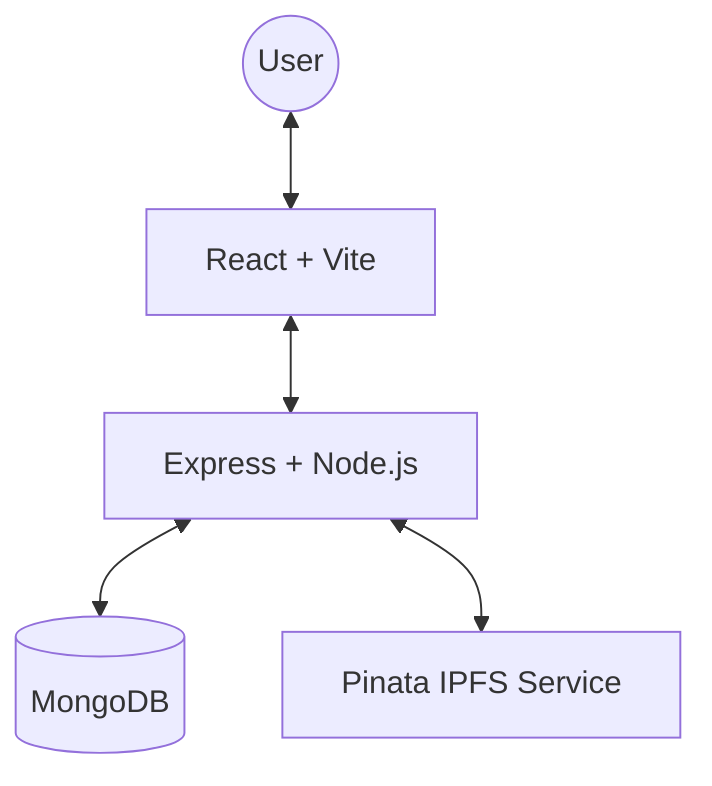

# SecureShare 🔒

A modern, high-performance MERN application for secure file sharing, decentralized storage, and controlled access management. Built with a focus on security, data integrity, and premium user experience.


## 🌟 Key Features

### 🚀 Core Functionality
- **Secure File Upload**: Upload files up to 10MB directly to IPFS via Pinata.
- **Controlled Sharing**: Share files with specific users using only their email addresses.
- **File Management**: Full control over your library—preview, download, or permanently remove your files.

### 🛡️ Security & Integrity
- **JWT Authentication**: Robust session management with standard 2-hour timeouts.
- **Atomic Transactions**: MongoDB transactions ensure account deletion and data removal happen safely or not at all.
- **Secure Middleware**: Hardened backend with mandatory environment variable validation for production readiness.
- **Data Privacy**: Users have total control over who can view their files.

### 📱 Premium UX/UI
- **Bright Design System**: A vibrant, modern color palette designed to WOW users.
- **Mobile Responsive**: Fully optimized for phones, tablets, and desktops (breakpoints up to 768px).
- **Interactive Previews**: Seamlessly preview images, videos, and text files without downloading.

## 🏗️ Technical Architecture



## 📂 Project Structure

- `client/` - React frontend (Vite)
- `server/` - Express backend (Node.js)

## 🛠️ Getting Started

### Prerequisites
- Node.js (v18+)
- MongoDB Atlas account (or local MongoDB)
- [Pinata](https://www.pinata.cloud/) API Key & Secret

### 1. Installation
```bash
# Install root dependencies
npm install

# Install client and server dependencies
cd client && npm install
cd ../server && npm install
```

### 2. Environment Setup

**server/.env:**
```env
MONGODB_URI=your_mongodb_connection_string
JWT_SECRET=your_secure_random_secret
PINATA_API_KEY=your_pinata_api_key
PINATA_SECRET_KEY=your_pinata_secret_key
PORT=5000
```

**client/.env:**
```env
VITE_API_URL=http://localhost:5000
```

### 3. Running Locally
```bash
# Start backend (from root)
npm run dev:server

# Start frontend (from root)
npm run dev:client
```

## 📝 License
MIT License. Built for Secure File Sharing.
